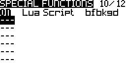

# Betaflight TX Lua Scripts

    

## Firmware Considerations

- Betaflight - As a best practice, it is recommended to use the most recent stable release of Betaflight to obtain the best possible results;
- OpenTX - 2.3.12 or newer;
- EdgeTX - 2.4.0 or newer;
- ExpressLRS - 2.0.1 or newer;
- Crossfire TX / RX - v2.11 or newer;
- FrSky TX / RX with support for SmartPort - While most receivers with SmartPort support work fine, it is recommended to update the receiver to the most recent firmware version to correct any known bugs in telemetry.

## Installing

**!! IMPORTANT: DON'T COPY THE CONTENTS OF THIS REPOSITORY ONTO YOUR SDCARD !!**

Download a zip file containing the latest version from the [releases page](https://github.com/betaflight/betaflight-tx-lua-scripts/releases).

Unzip the files from the link above and drag the contents of the `obj` folder to your radios SD card. If you do this correctly, the `SCRIPTS` directory will merge with your existing directories, placing the scripts in their appropriate paths.  You will know if you did this correctly if the `bf.lua` file shows up in your `/SCRIPTS/TOOLS` directory.

### How to install

Bootloader Method

1. Power off your transmitter and power it back on in boot loader mode.
2. Connect a USB cable and open the SD card drive on your computer.
3. Unzip the file and copy the scripts to the root of the SD card.
4. Unplug the USB cable and power cycle your transmitter.

Manual method (varies, based on the model of your transmitter)

1. Power off your transmitter.
2. Remove the SD card and plug it into a computer
3. Unzip the file and copy the scripts to the root of the SD card.
4. Reinsert your SD card into the transmitter
5. Power up your transmitter.

If you copied the files correctly, you can now go into the OpenTx Tools screen from the main menu and access the Betaflight Configuration tool. The first time you run the script, a message 'Compiling...' will appear in the display before the script is started - this is normal, and is done to minimise the RAM usage of the script.

### Running the script as a telemetry page

Due to issues with input mapping and memory overruns, running the script as a telemetry page **is no longer supported**. The only way to run the script is through the Tools screen in the OpenTX main menu.

### Setting up VTX Tables

If you are using a VTX that supports the SmartAudio or Tramp protocols then bands and channels etc. are managed using VTX tables since Betaflight version 4.1.0. The script will be downloading and storing the current VTX table for every model the first time the model is connected and the script is run. If you change the VTX table, you have to re-load the updated VTX table in the script, by choosing the 'vtx tables' option in the function menu.

### Background script
The optional background script offers RTC synchronization and RSSI through MSP. It can be setup as a special or global function in OpenTX. The image below shows how to run the background script as a special function.

## Unstable Testing Versions
Unstable testing versions of the latest builds of the Lua Script can be downloaded from [here](https://github.com/betaflight/betaflight-tx-lua-scripts-nightlies/releases).

Be aware that these versions are intended for testing / feedback only, and may be buggy or broken. Caution is advised when using these versions.

## Building from source

- Be sure to have `make` and `luac` in version 5.2 installed in the path
- Run `make` from the root folder
- The installation files will be created in the `obj` folder. Copy the files to your transmitter as instructed in the '[Installing](#installing)' section as if you unzipped from a downloaded file.
