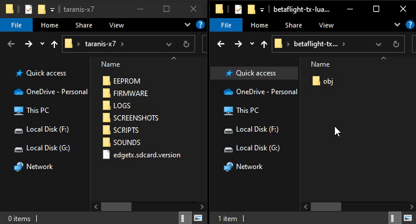
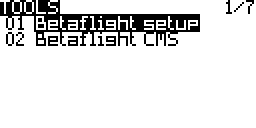
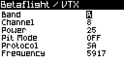

   

## Requirements

- Betaflight - As a best practice, it is recommended to use the most recent stable release of Betaflight to obtain the best possible results;
- Telemetry - Telemetry has to be enabled in Betaflight Receiver tab and supported by the TX / RX for the scripts to be able to communicate with the flight controller;
- OpenTX - 2.3.12 or newer;
- EdgeTX - 2.4.0 or newer;
- ExpressLRS - 2.0.1 or newer;
- TBS Crossfire/Tracer TX / RX - v2.11 or newer;
- FrSky TX / RX with support for SmartPort - While most receivers with SmartPort support work fine, it is recommended to update the receiver to the most recent firmware version to correct any known bugs in telemetry.
- ImmersionRC Ghost RX module - Latest firmware and module set to RF Mode "Race250" - see (Ghost receiver manual pg 36-38) (Other RF Modes have issues or do not have telemetry to allow Betaflight LUA to work).
- Baud rate - Set to 400K in EdgeTX/OpenTX for Crossfire, Tracer, ExpressLRS.

## Installing

**!! IMPORTANT: DON'T COPY THE CONTENTS OF THIS REPOSITORY ONTO YOUR SDCARD !!**

Download a zip file containing the latest version from the [releases page](https://github.com/betaflight/betaflight-tx-lua-scripts/releases).

Unzip the files from the link above and drag the contents of the `obj` folder to your radios SD card. If you do this correctly, the `SCRIPTS` directory will merge with your existing directories, placing the scripts in their appropriate paths.  You will know if you did this correctly if the `bf.lua` file shows up in your `/SCRIPTS/TOOLS` directory.

## How to use

Navigate to the TOOLS menu in OpenTX, select "Betaflight setup" or "Betaflight CMS" and press the [ENTER] button. The first time the script is launched after a clean install or upgrade it will go through it's compile procedure and exit back to the TOOLS menu when it's done.

### Betaflight setup

The "Betaflight setup" script lets you configure Betaflight through the MSP protocol.

<kbd></kbd>

#### Controls

- [+] / [-] / [ROTARY ENCODER] - Used to navigate.
- [PAGE] - Press to move to the next page. Long press to move to the previous page.
- [ENTER] - Press to access the selected element. Long press to open the function menu.
- [EXIT] - Press to go back or exit the script.

#### Saving your changes

Any changes to parameters in the script will not take effect until a save is manually initiated. Change the parameters you want to change, open the function menu by long pressing [ENTER] and select "save page" to send the modified parameters back to the flight controller. 

#### Setting up VTX tables

If you are using a VTX that supports the SmartAudio or Tramp protocols then bands and channels etc. are managed using VTX tables since Betaflight version 4.1.0. The script will be downloading and storing the current VTX table for every model the first time the model is connected and the script is run. If you change the VTX table, you have to re-load the updated VTX table in the script, by choosing the 'vtx tables' option in the function menu.

Depending on the size of the vtx tables and the telemetry protocol used, downloading the vtx tables can take a while.

<kbd></kbd>

Please note that if the "VTX" feature wasn't included in your Betaflight firmware build, the downloading of the VTX tables will be skipped and the VTX menu item won't be available. The initial setup of the VTX/VTX tables must be done using the [Configurator](https://github.com/betaflight/betaflight-configurator).

### Betaflight CMS

**!! IMPORTANT: TBS Crossfire/Tracer only !!**

"Betaflight CMS" lets you access the same CMS menu that is available in the OSD.

<kbd></kbd>

#### Controls

- [PITCH] - Navigate the current menu.
- [ROLL] - Enter menu or change selected parameter.
- [YAW] - Left to go back and right to enter the "SAVE / EXIT" menu.
- [+] / [ENTER] - Manual refresh. Press if the script doesn't update.
- [EXIT] - Close CMS menu and exit script. **!! IMPORTANT: Single press only. Long press will exit the script without closing CMS and as a result you will not be able to arm !!**

### Background script

The optional background script offers RTC synchronization and RSSI through MSP. RSSI will only be sent if no other RSSI source is detected. It can be setup as a special or global function in OpenTX. The image below shows how to run the background script as a special function.

<kbd></kbd>

## Unstable testing versions

Unstable testing versions of the latest builds of the Lua Script can be downloaded from [here](https://github.com/betaflight/betaflight-tx-lua-scripts-nightlies/releases).

Be aware that these versions are intended for testing / feedback only, and may be buggy or broken. Caution is advised when using these versions.

## Building from source

- Be sure to have `make` and `luac` in version 5.2 installed in the path
- Run `make` from the root folder
- The installation files will be created in the `obj` folder. Copy the files to your transmitter as instructed in the '[Installing](#installing)' section as if you unzipped from a downloaded file.
